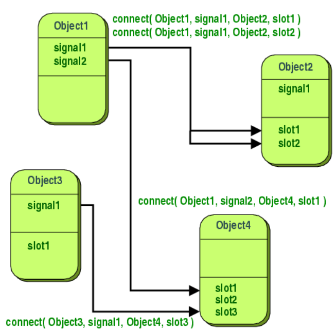

# 信号与槽

在 GUI 编程中，当更改一个地方时，我们通常希望通知另外一个地方。即对象之间能够相互通信。一般的 UI 框架往往都会使用回调的方式来实现。而在 Qt 中。则采用了另外一种方式，即信号与槽，它是 Qt 中的一个核心机制，基于 Qt 的 `meta-object system` 实现的。

- 信号与槽是松散耦合的，发出信号的类既不知道也不关心哪些槽接收信号
- 信号与槽是类型安全的，信号的签名必须与接收槽的签名相匹配。（槽的签名可能更短，因为可以忽略某些参数）

## singnals 
当对象内部状态发生变化时，对象就会发出信号，信号是一个公共访问函数，可以从任何地方发出，但是建议从定义信号的类和它的子类中发出。
当发出信号时，与其连接的槽会立即被执行。此时，信号和槽机制完全独立于 GUI 事件循环。
当所有的槽执行完成后，`emit` 后面的代码会被执行。（如何槽里面执行了耗时操作？）
当使用 `queue connnection` 时，会先执行 `emit` 后面的代码，槽会在稍后执行。
如果多个槽连接到同一个信号，则按照连接的顺序依次执行。
信号由 `moc` 自动生成，不能在 `.cpp` 文件中实现。不能有返回类型。

## slots 
槽是一个普通的成员函数，可以正常调用，它的唯一特点是可以连接到信号。
不管槽的访问级别，它们可以由任何组件通过信号连接槽调用。从任意类的实例发出的信号可能会导致在不相关的类的实例中调用私有槽。
可以将槽定义为虚拟槽
信号和槽提供了更高的灵活性，因此比回调函数更慢，但是在实际应用程序的差异微不足道。

## meta-object

## 引用
- https://doc.qt.io/qt-6/metaobjects.html
- https://woboq.com/blog/how-qt-signals-slots-work.html