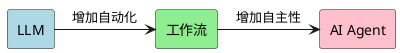

- 什么是 AI Agent 
- AI Agent 的演化过程
- 相关的技术和解决的问题
- AI Agent 的实现
- AI Agent 解决了什么问题
- AI Agent 的限制
- 实现一个简单的 AI Agent

# 什么是 AI Agent 

## Agent 常见的定义

- 一种能够自主地在环境中行动，以实现目标的计算系统
- 一种通过传感器感知环境，并通过执行器作用于环境的自主实体
- 由大语言模型驱动的自主代理，具备三大核心能力， 规划，行动，记忆。

所以通俗来讲，人工智能代理是一种能够根据给定的信息进行自行推理（reason）、规划(plan)、采取行动(action)的系统。

## 什么不是 AI Agent

- 一个传统自动化流程是不是 AI Agent， 比如 `UTS 日构建` 
- 使用 LLM 能力， AI 驱动的自动化是不是 AI Agent, 比如 `UDI 文档翻译助手`

上面两个例子都是一个基于静态的规则的过程，比如从步骤A -> B -> C . 过程中不存在推理的过程。

**总结一下**：

自动化 = 基于**静态**的预先定义的固定步骤

AI Agent = **动态**的、灵活的、具有推理能力的

*对于自动化和工作流以及 AI Agent，选择能够完成我们任务的就好，越简单越好*

# AI Agent 的演化过程

## LLM 时代  - 对话式交互

- LLM 的基本能力：理解和生成
- 典型应用：ChatGPT、Kimi
- 大语言模型的限制：

    1. 尽管它们接受过大量数据的训练，但他们对专有信息的了解是有限的，知识限于训练数据。

    2. 大语言模型的交互是被动的， 它需要等待我们输入提示词，然后响应， 缺乏主动性，也无法持续执行任务。

    3. 执行能力的缺失，输出限于文本形式，无法直接操作外部系统。

## AI 工作流 - 流程自动化

- 工作流的概念：预定义的任务序列。但是相对于 LLM 增加了 检索，记忆，和使用工具的能力。 因此相对于 LLM, 工作流解决了如下问题：
    1. 解决了执行能力缺失的问题 
    2. 解决了持续执行的问题，可以按照预定流程执行多个步骤 (MCP)
    3. 解决了专有信息访问的限制。（RAG）

- 典型应用：UDI 文档翻译助手， 代码生成
- 工作流的限制：
    1. 工作流的流程都是预先定义好的，缺乏灵活性和自适应能力，如果没有手动更新，就无法适应新的规则
    2. 推理能力有限，决策主要基于预设的规则

## AI Agent - 智能自主

- Agent 的核心特征：感知、决策、行动。 Agent 相对于工作流，Agent 增加了**自主执行的能力**和**适应性**（反馈学习的能力）。
- Agent 与工作流的本质区别：
  - 动态规划 vs 固定流程
  - 自主决策 vs 预定规则
  - 反馈学习 vs 单向执行
- 典型应用：
  - AutoGPT：自主任务完成
  - GitHub Copilot：智能编程助手

# How AI Agents work

AI Agent 的工作原理可以概括为"感知-决策-行动"的循环过程，主要包含以下核心组件：

1. 大脑 (Brain)/执行器/模型 (LLM): 大脑是为代理提供动力的大型语言模型。 它处理推理、规划和语言生成

2. 记忆（Memory）:记忆使代理能够记住过去的互动并利用该背景让 Agent 构建上下文以便做出更好的决策
   - 短期记忆：如对话历史
   - 长期记忆：如数据库中存储的重要信息

3. 工具 (Tools):  工具是代理与外界互动的方式。 一般将工具分为三类
    - Data. 检索数据或上下文, 比如搜索网页或者检测文档	 (RAG)
    - Action. 采取行动，比如发邮件或者更新文档
    - Orchestration 编排，调用其他的 Agent, 触发工作流，或者是将操作链接在一起

4. 指令 (Instructions): 最常见的指令就是提示词。 指令可以定义 agent 的角色和目标，指定成功标准和可用工具。设置响应方式等。

# dify example

# n8n example
     

# Limitations of AI Agents

## 参考资料
- https://github.com/AIGeniusInstitute/AI-Agent-In-Action
- https://github.com/resources/articles/ai/what-are-ai-agents
- https://github.com/ashishpatel26/500-AI-Agents-Projects
- https://github.blog/ai-and-ml/github-copilot/mastering-github-copilot-when-to-use-ai-agent-mode/