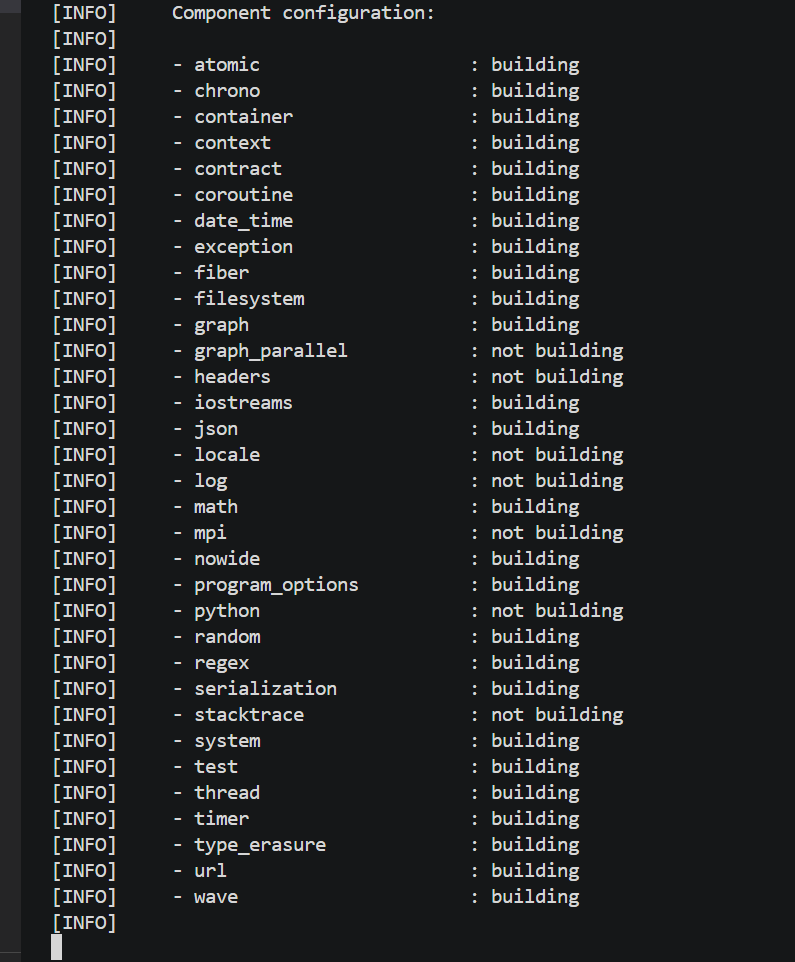

# 如何裁剪 BOOST 库

最近有用户反馈我们提供的 SDK 每次更改配置后都需要 conan 重新通过源码编译，而这个编译时间有点太长了，尤其是在编译 SDK 依赖的 BOOST 库时。

因此我们需要裁剪掉我们不需要使用到的模块。

至于如果裁剪，我们应该保持一个原则，只编译我们明确需要使用到的模块(**`include what you need`**)。而为了达到这个目的，我们需要对 BOOST 有一定的认知才能做到，

## 简单学习 BOOST 库

> 学习任何内容，先阅读它的官方文档都是一个不错的选择：  [BOOST](https://www.boost.org/doc/user-guide/intro.html)

## conan 中的 BOOST 选项

通过 [Boost 的 conanfile.py](https://github.com/conan-io/conan-center-index/blob/master/recipes/boost/all/conanfile.py), 我们可以查看 BOOST 可以设置的选项。

另外一个简单且直接的方法就是上图中 conan 的输出。

